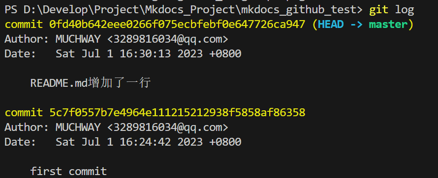

# Github基本原理和操作

## 参考资料
[猴子都能学会的git入门](https://backlog.com/git-tutorial/cn/)


## Git基本原理
[Git工作流和核心原理 | GitHub基本操作 | VS Code里使用Git和关联GitHub](https://www.bilibili.com/video/BV1r3411F7kn/?spm_id_from%253D333.337.search-card.all.click)

形象地理解Git的原理<br>
<br>
具体的Git原理<br>
<br>
我们自己电脑中的文件夹叫做工作区，还有一个隐藏的.git文件夹，叫做版本库，版本库里面存了很多东西，其中最重要的就是stage（暂存区）<bar>
在自己文件中对文件进行修改后，需要先add到暂存区，然后再commit到分支上，最后才是pull到远程仓库<br>
还有Git为我们自动创建了第一个分支master，以及指向master的一个指针HEAD。<br> 

## GitHub基本操作
### 配置Git用户名和邮箱
```bash
git config --global user.name "Your Name"
git config --global user.email "Your Email"
```
### 查看git配置
```bash
git config --list
```

### 生成ssh key
```bash
ssh-keygen -t rsa -C "XXX@XX.com"
```
然后一路回车，生成ssh key。<br>
然后在.ssh文件夹下面会生成id_rsa和id_rsa.pub两个文件，id_rsa是私钥，id_rsa.pub是公钥。<br>

### 添加ssh key到github
打开id_rsa.pub文件，复制里面的内容，然后打开github，点击头像，选择settings，然后选择SSH and GPG keys，然后点击New SSH key，然后把复制的内容粘贴到key里面，然后点击Add SSH key。<br>

### 测试ssh key是否配置成功
```bash
ssh -T
```
如果出现Hi MUCHWAY! You've successfully authenticated, but GitHub does not provide shell access.说明配置成功了。<br>

### 创建版本库
```bash
git init
```
这样会创建一个.git文件夹，是隐藏的，对于git各种数据都记录在这个文件夹里面。初始化后，默认处于master分支。

### 新建一个文件
```bash
echo 'my wiki' > README.md
```

### 查看状态
```bash
git status
```
可以看到README.md文件处于未跟踪状态：<br>
<br>
他还提示了我们可以使用git add命令将其添加到暂存区。<br>

### 添加文件到版本库
```bash
git add .  # 添加所有文件到暂存区
```

### 再次查看状态
```bash
git status
```
可以看到README.md和其他所有文件处于暂存区：<br>
<br>

### 提交文件到版本库
```bash
git commit -m "first commit"  # 提交到分支, -m后面是本次提交的说明
```

### 查看提交日志
```bash 
git log
```
可以看到我们刚刚提交的commit：<br>
<br>

### 修改文件
```bash
echo '## Git工作流和核心原理' >> README.md
```
然后再次
```bash
git add README.md
```
```bash
git commit -m 'README.md增加了一行'
```
这之后我们再看提交日志：<br>
<br>
可以看到我们的提交日志是有两个的，第一个是我们第一次提交的，第二个是我们第二次提交的，这就是我们的版本控制。<br>

### 提交到远程仓库
```bash
git remote add origin git@github.com:MUCHWAY/mkdocs_github_test.git
```
origin是远程仓库的名字，可以自己取名字，但是一般都叫origin。<br>
```bash
git push -u origin master
```
-u是第一次提交的时候需要加的，以后就不需要了。<br>
这样就把本地的master分支推送到了远程仓库origin上面。<br>
<br>
可以看到我们的github上面已经有了我们的文件了：<br>
<br>

### 提交忽略文件
先创建一个.gitignore文件
```bash
touch .gitignore
```
然后在.gitignore文件中写入忽略文件的规则，比如忽略掉*.pyc文件，就可以写成*.pyc。<br>
然后再次add和commit，然后再次push到远程仓库。<br>
可以看到我们的*.pyc文件已经被忽略了。<br>


### 创建新的分支
```bash
git branch dev  # 创建dev分支
```
切换到dev分支
```bash
git checkout dev
```
或者可以直接创建并切换到dev分支 
```bash
git checkout -b dev  # 创建并切换到dev分支
```
此外
```bash 
git branch  # 查看当前分支
```
```bash 
git checkout master  # 切换到master分支
```
```bash
git branch -d dev  # 删除dev分支
```

### 合并分支
```bash
git merge dev  # 把dev分支合并到当前分支
```
合并完成后，可以删除dev分支了。<br>
### 

### 从远程仓库中删除文件
```bash
git rm -r --cached .  # 删除本地缓存
git add .  # 重新trace file
git commit -m "fixed untracked files"
git push origin master
```

### checkout命令
用于切换分支或恢复文件。它的作用取决于使用的参数。
```bash
 git checkout <branch>
 ```
它将会切换到指定的分支，并将工作目录更新为该分支的最新版本。
```bash
git checkout <commit>
```
它将会将工作目录更新为指定提交的版本，并将代码恢复到该提交的状态。这可以用于恢复到之前的版本，或者查看某个提交的代码。
```bash
git checkout -- <file>
```
它将会将指定文件恢复到最近一次提交的状态。这可以用于撤销对文件的更改。
```bash
git checkout
```
会更改工作目录和代码状态，因此在使用该命令之前，请确保已经保存了所有更改，并且已经提交了所有需要提交的更改。

## 常见问题
### .gitignore设置后不起作用
[参考连接](https://lanyue.blog.csdn.net/article/details/119578464?spm%253D1001.2101.3001.6650.1%2526utm_medium%253Ddistribute.pc_relevant.none-task-blog-2~default~CTRLIST~Rate-1-119578464-blog-122837214.235%255Ev38%255Epc_relevant_anti_t3%2526depth_1-utm_source%253Ddistribute.pc_relevant.none-task-blog-2~default~CTRLIST~Rate-1-119578464-blog-122837214.235%255Ev38%255Epc_relevant_anti_t3%2526utm_relevant_index%253D2)

其中一种解决方法是：
```bash
git rm -r --cached .  # 删除本地缓存
git add .  # 重新trace file
git commit -m "fixed untracked files"
git push origin master
```
### git pull报错
```bash
MUCHWAY: error: Your local changes to the following files would be overwritten by merge:
        docs/index.md
        mkdocs.yml
Please commit your changes or stash them before you merge.
Aborting
```
这个错误提示表明你在本地修改了 `docs/index.md` 和 `mkdocs.yml` 这两个文件，而这些修改与你从远程仓库拉取的代码产生了冲突。你有两个解决方案：
1. 在拉取远程仓库的代码之前，先将你的本地修改提交到本地仓库。你可以执行以下命令：
```bash
git add docs/index.md mkdocs.yml
git commit -m "Committing changes before pulling from remote repository"
git pull
```
2. 在拉取远程仓库的代码之前，将你的本地修改暂存起来。你可以执行以下命令：
```bash
git stash
git pull
```
拉取完代码后，你可以使用 `git stash apply` 命令将你的修改应用回来。<br>
`git stash` 命令可以将你的本地修改暂存起来，以便你可以在不提交修改的情况下切换分支或拉取远程仓库的代码。当你执行 `git stash` 命令时，Git会将你的本地修改保存到一个栈中，并将你的工作目录恢复到上一次提交的状态。这样，你就可以在不提交修改的情况下执行其他操作，比如切换分支或拉取远程仓库的代码。
当你需要恢复你的本地修改时，可以使用 `git stash apply` 命令将你的修改应用回来。如果你有多个暂存的修改，可以使用 `git stash list` 命令查看所有的暂存记录，并使用 `git stash apply stash@{n}` 命令将指定的暂存记录应用回来。


3. 还有以一种情况是想让远程仓库的代码覆盖我本地的代码<br>
执行 `git fetch` 命令拉取远程仓库的代码;<br>
执行 `git reset` 命令将本地仓库的 HEAD 指针指向远程仓库的代码;<br>
这个命令会将本地仓库的 HEAD 指针指向远程仓库的 master 分支的最新提交，同时将你本地的代码覆盖为远程仓库的代码。<br>
注意：这个操作会丢失你本地未提交的修改，请确保你已经将本地的修改提交或者暂存起来了。


