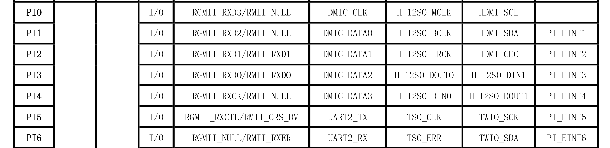

# 喊话器

## 编译MavSDK

### 编译命令

```bash
cmake -DCMAKE_BUILD_TYPE=Debug -DCMAKE_INSTALL_PREFIX=install -DBUILD_MAVSDK_SERVER=ON -DBUILD_SHARED_LIBS=ON -DMAVLINK_DIALECT=custom -DBUILD_THIRD_PARTY=ON -DMANUAL_SPECIFIED_CUSTOM_TOOLCHAIN=ON -DCUSTOM_TOOLCHAIN_PATH=/home/muchway/lubancat/mavlink/Toolchain_aarch64_linux_gnu.cmake -DBUILD_CUSTOM_MAVLINK=ON -DCUSTOM_MAVLINK_PATH=/home/muchway/lubancat/mavlink/mavlink -DBUILD_CUSTOM_PLUGINS=ON -DCMAKE_EXPORT_COMPILE_COMMANDS=ON -Bbuild/default -H.


cmake -DCMAKE_BUILD_TYPE=Debug -DCMAKE_INSTALL_PREFIX=/home/muchway/lubancat/mavlink/CustomMAVSDK_Playlod/custom_mavsdk_lib -DBUILD_MAVSDK_SERVER=ON -DBUILD_SHARED_LIBS=ON -DMAVLINK_DIALECT=custom -DBUILD_THIRD_PARTY=ON -DCUSTOM_TOOLCHAIN_PATH=/home/muchway/lubancat/mavlink/Toolchain_aarch64_linux_gnu.cmake -DBUILD_CUSTOM_MAVLINK=ON -DCUSTOM_MAVLINK_PATH=/home/muchway/lubancat/mavlink/mavlink -DBUILD_CUSTOM_PLUGINS=ON -DCMAKE_EXPORT_COMPILE_COMMANDS=ON -Bbuild/default -H.


cmake --build build/default --target install -j4

cmake -Bbuild -H. -DCUSTOM_TOOLCHAIN_PATH=/home/muchway/lubancat/mavlink/Toolchain_aarch64_linux_gnu.cmake -DCMAKE_PREFIX_PATH=/home/muchway/lubancat/mavlink/Custom_MAVSDK/install

export LD_LIBRARY_PATH=/home/cat/ffmpeg_rockchip/ffmpeg_7_rockchip_install/lib:/home/cat/vmware/mavlink/Custom_MAVSDK/install/lib
```

### 编译过程中的意外处理

* libmz

    把手动下载的压缩包解压到指定的目录下，然后再编译的时候就不会再去下载了。
    ```bash
    tar -xvf xxx/xz-5.4.5.tar.gz -C xxx/liblzma
    ```
    注释掉下载的部分，直接指定解压后的目录。
    ```cmake
    # URL https://github.com/tukaani-project/xz/releases/download/v5.4.5/xz-5.4.5.tar.gz
    # URL_MD5 d2bb81e1a1a7808352c4ca28622f5c72
    SOURCE_DIR /home/muchway/lubancat/mavlink/Custom_MAVSDK/build/default/third_party/liblzma/liblzma-prefix/src/liblzma
    ```

* zlib-ng

    ```bash
    tar -xvf xxx/zlib-ng-2.1.6.tar.gz -C xxx/zlib-ng
    ```

    ```cmake
    # URL https://github.com/zlib-ng/zlib-ng/archive/refs/tags/2.1.6.tar.gz
    SOURCE_DIR /home/muchway/lubancat/mavlink/Custom_MAVSDK/build/default/third_party/zlib-ng/zlib-ng/src/zlib-ng
    ```

* libopenssl

    ```bash
    tar -xvf xxx/openssl-1.1.1l.tar.gz -C xxx/openssl
    ```

    ```cmake
    # URL https://www.openssl.org/source/openssl-${OPENSSL_VERSION}.tar.gz
    SOURCE_DIR /home/muchway/lubancat/mavlink/Custom_MAVSDK/build/default/third_party/openssl/openssl/src/openssl
    ```
    出现报警，会卡一会，但是不用管，能过去的。
    ```bash
    make[3]: 警告: jobserver 不可用: 正使用 -j1。添加 “+” 到父 make 的规则。
    ```

* cares

    ```bash
    tar -xvf build/default/third_party/cares/cares/src/c-ares-1.19.1.tar.gz -C /build/default/third_party/cares/cares/src
    ```

    ```cmake
    # URL https://github.com/c-ares/c-ares/releases/download/cares-1_19_1/c-ares-1.19.1.tar.gz
    SOURCE_DIR /home/muchway/lubancat/mavlink/Custom_MAVSDK/build/default/third_party/cares/cares/src/cares
    ```
* protobuf

    ```bash
    tar -xvf build/default/third_party/protobuf/protobuf/src/protobuf-25.1.tar.gz -C build/default/third_party/protobuf/protobuf/src
    ```

    ```cmake
    # URL https://github.com/protocolbuffers/protobuf/releases/download/v25.1/protobuf-25.1.tar.gz
    SOURCE_DIR /home/muchway/lubancat/mavlink/Custom_MAVSDK/build/default/third_party/protobuf/protobuf/src/protobuf
    ```


## 编译CustomMavsdk_Playlod的第三方库

### 编译alsa

```bash
./configure --host=aarch64-linux-gnu --prefix=$PWD/_install --disable-python --disable-shared

make -j4

make install
```

## 关键点记录

### 验证GPIO




下面这张图是从orangepi zero 2w上面用gpio readall读出来的：


全志H618的GPIO：[参考链接](https://blog.csdn.net/m0_54943420/article/details/142300115)

GPIO编号 = 控制器端口号 * 32 + 索引序号
对于控制器端口号，例如GPIOA就是0 GPIOC就是2，对于PI4，就是: (I-A) * 32 + 4 = 260

```bash
#以下所有操作均需要打开管理者权限使用，使用sudo -s
#使能引脚GPIO1_C4
echo 260 > /sys/class/gpio/export
echo 260 | sudo tee /sys/class/gpio/export

#设置引脚为输入模式
echo in > /sys/class/gpio/gpio260/direction
#读取引脚的值
cat /sys/class/gpio/gpio260/value

#设置引脚为输出模式
echo out > /sys/class/gpio/gpio260/direction
#设置引脚为低电平
echo 0 > /sys/class/gpio/gpio260/value
#设置引脚为高电平
echo 1 > /sys/class/gpio/gpio260/value

#复位引脚
echo 260 > /sys/class/gpio/unexport
```

野火的GPIO教程：[参考链接](https://doc.embedfire.com/linux/rk356x/quick_start/zh/latest/quick_start/40pin/gpio/gpio.html)

### 验证串口

```bash
sudo stty -F /dev/ttyS1 115200 cs8 -cstopb -parenb
echo "Hello, ttyS1" > /dev/ttyS1
```
通过验证发现，串口0默认是做调试用，1、3、4是直接可以使用的，2是用来做蓝牙的，需要重新配置才能作为普通串口。

### 配置设备树

### 验证音频驱动

* GUI工具
    
    ```bash
    alsamixer
    ```

* 列举音频驱动
  
* 获取音量

* 设置音量
  
* 播放PCM
  
    ```bash
    ffplay -nodisp -autoexit -ar 16000 -f s16le -i ./test_file/pcm_file/recorder.pcm
    ```


### 挂载NFS

```bash
sudo mount -t nfs -o nolock,nfsvers=3 192.168.101.77:/home/muchway/zero3 /home/orangepi/vmware
```

### 验证载板

一开始做测试时候，我是接了功放板子和载板，发现系统启动不了，调试串口打印的有很多乱码。然后又去做各种测试，发现只有用电脑连接usb时候可以正常启动。后面排查发现是调试串口没有接地的原因。
在此基础上再做实验，有以下现象：

| TTL 2 USB连接PC | | TTL 2 USB不接PC| | 短接TX和RX | TX和RX悬空 |
|:-:|:-:|:-:|:-:|:-:|:-:|
|接GND|不接GND|接GND|不接GND| | |
| 能    | 不能     | 能         | 不能          | 不能   | 能      |

经过研究发现，我们画的载板、官方的载板、orangepi zero 2w，都是一样的现象。

短接TX和RX的原因是，短接之后，TX的输出就作为指令往RX发了，系统不知道怎么回复这些东西，就打断了启动的步骤，所以就启动不起来。

还有发现：
接GND: TX=3.2V, RX=0V; 不接GND：TX=0.6V, RX=1.38V
不知道这是什么道理，大概率是跟我用的串口转USB模块有关系。


